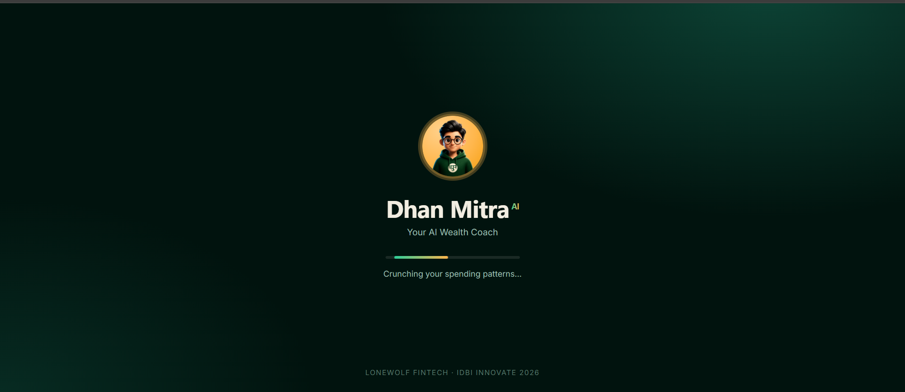
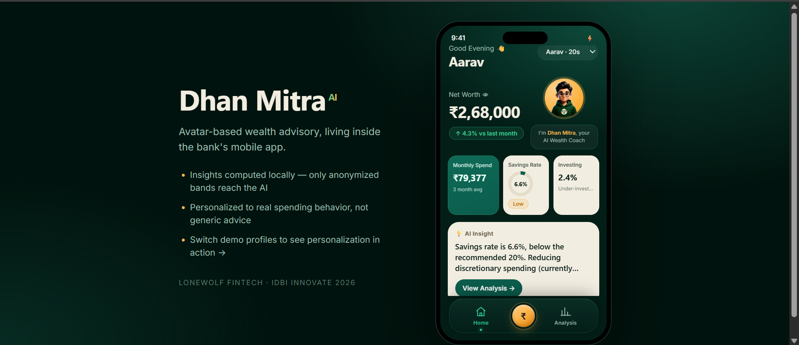
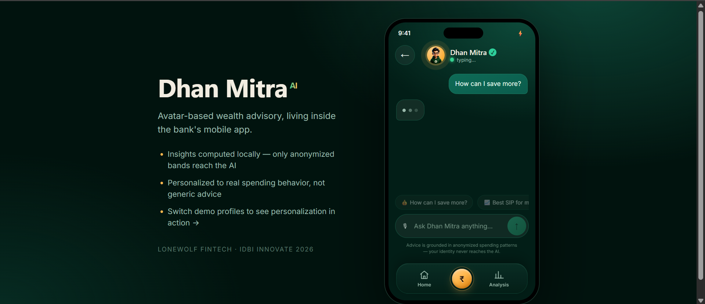
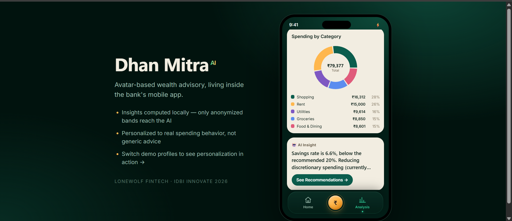
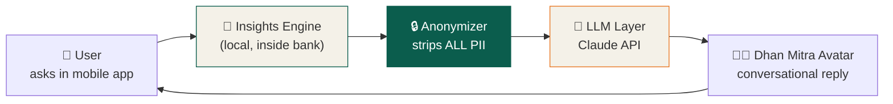
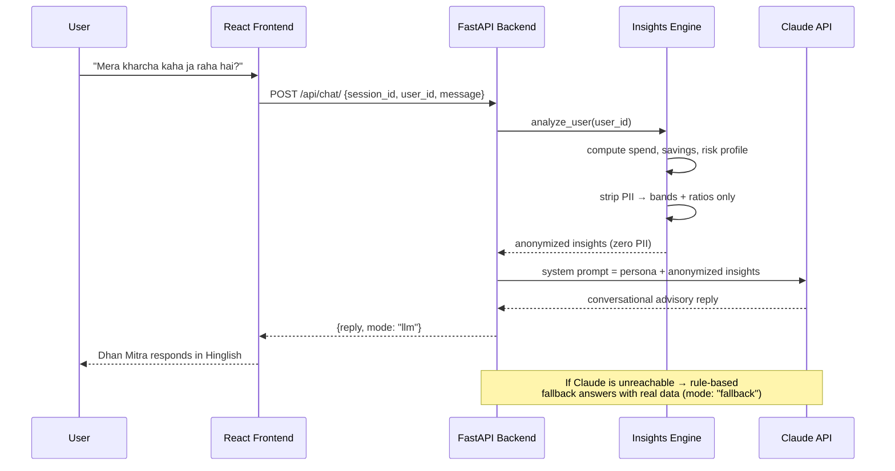
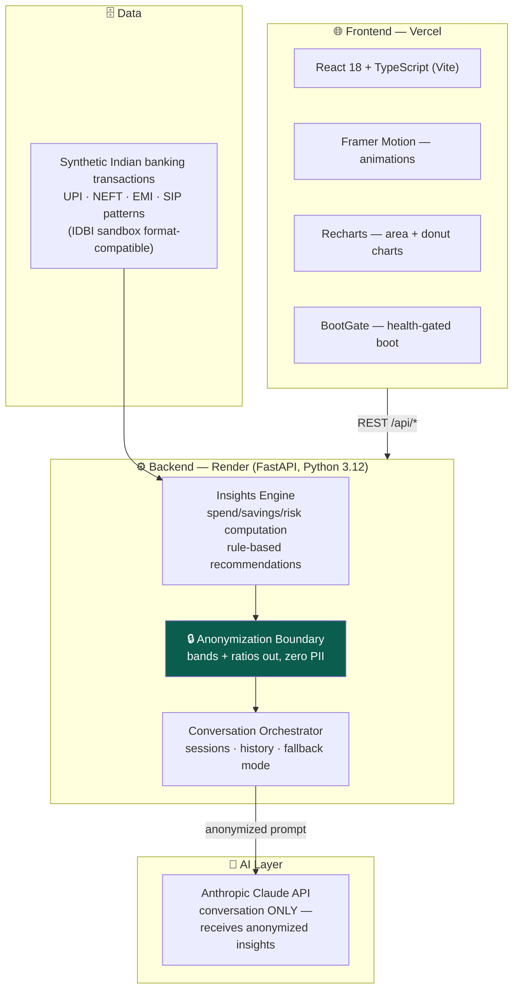

<div align="center">

# 💰 Dhan Mitra — AI Wealth Advisor Avatar

### *Wealth advisory for the 95% who never get one.*

**Team LoneWolf FinTech · IDBI Innovate 2026 · Track 01**

[](https://lonewolf-fintech.vercel.app)
[](https://lonewolf-fintech-api.onrender.com/docs)
[](#-demo-video)

<url src="https://github.com/himanshuxoox/lonewolf-fintech/blob/main/docs/screenshots/demo.mp4" alt="Dhan Mitra Dashboard" width="260"/>

</div>

---

## 📌 The Problem

Wealth management and advisory services remain fragmented and largely inaccessible to most banking customers. Banks sit on rich transaction data, yet the absence of comprehensive analysis of customer investment behaviour and spending habits means **no timely, personalized, data-driven guidance** ever reaches the ordinary customer. Human advisors are reserved for high-net-worth clients — everyone else gets generic content.

## 💡 The Solution

**Dhan Mitra** ("Money Friend") is an AI-powered, avatar-based digital wealth advisor that integrates into the bank's mobile app. It analyzes each customer's real spending behaviour locally, computes explainable financial insights, and delivers them through a natural conversation — in the customer's own language (English / Hinglish).

> **The one-line differentiator:** the AI never sees customer data. A local insights engine does all sensitive computation; only anonymized behavioral bands cross the AI boundary. This makes Dhan Mitra *bank-deployable*, not just demo-friendly.

---

## 📱 Product Walkthrough

| Loading (BootGate) | Home Dashboard | AI Chat | Spending Analysis |
|:---:|:---:|:---:|:---:|
|  |  |  |  |
| Health-gated boot handles cold starts gracefully | Live financial health: net worth, spend, savings gauge, AI insight | Hinglish conversation grounded in real numbers | Daily trend + category donut from live API |


---

## 🔄 How It Works — End-to-End Flow



**The green box is the trust boundary.** Everything left of it stays inside the bank's infrastructure. Everything right of it sees zero personally identifiable information.

### What crosses the boundary (and what never does)

| ❌ Never reaches the AI | ✅ What the AI receives instead |
|---|---|
| Name, account number, customer ID | Behavioral segment ("Young Professional — High Spender") |
| Exact income ₹85,000 | Income band `50k–1L` |
| Exact age 26 | Age band `20s` |
| Raw transactions, merchant names, txn IDs | Aggregated ratios: savings rate 6.6%, top category "Shopping" |

---

## 🗣️ Conversation Flow



---

## 🏗️ Architecture



---

## ✨ Features

| Feature | Detail |
|---|---|
| 🧑‍💼 **Conversational AI Avatar** | Natural chat in English/Hinglish, mirrors the user's language, multi-turn session memory |
| 📊 **Live Financial Dashboard** | Net worth counter, monthly spend, animated savings-rate gauge, investing %, investor typing |
| 📈 **Spending Analysis Studio** | 65-day daily spend trend (area chart), category donut, discretionary vs essential split |
| 🎯 **Personalized Recommendations** | SIP sizing, budget trims, 100-minus-age allocation — every figure traces to real computation |
| 🔒 **Privacy Boundary** | PII stripped before the AI; income/age converted to bands; no transaction IDs cross over |
| 👥 **Behavioral Profiles** | 3 demo personas prove personalization: same engine, visibly different guidance |
| ⚡ **Quick Actions** | One-tap prompts: Reduce Spending · Start SIP · Check Expenses · Financial Goals |
| 🛡️ **Resilience Built-in** | Rule-based LLM fallback (advisor never goes dark) + cold-start BootGate loading experience |

---

## 👥 Demo Personas — Personalization Proof

Switch profiles from the dashboard dropdown and watch every number and recommendation change:

| Persona | Profile | Engine Output |
|---|---|---|
| **Aarav** · 20s | Young professional, high spender | Savings 6.6% (flagged low) · Under-invested · "Shopping is your leaky bucket" |
| **Meera** · 30s | Mid-career balanced saver | Savings 67% (healthy) · Active investor · tax-optimization nudges |
| **Rajan** · 40s | Conservative FD-heavy saver | Over-conservative allocation · age-based equity rebalancing guidance |

---

## 🔌 API Reference

Interactive docs: **[`/docs` on the live API](https://lonewolf-fintech-api.onrender.com/docs)**

| Method | Endpoint | Purpose |
|---|---|---|
| `GET` | `/health` | Liveness check (used by frontend BootGate) |
| `GET` | `/api/insights/users` | List demo user IDs |
| `POST` | `/api/insights/analyze` | Anonymized insights for a user (spend, ratios, recommendations) |
| `GET` | `/api/insights/timeseries/{user_id}` | Daily spend series for trend chart |
| `POST` | `/api/chat/` | Send message → advisory reply (`mode: llm` or `fallback`) |
| `GET` | `/api/chat/history/{session_id}` | Session conversation history |

---

## 🛠️ Tech Stack

| Layer | Technology |
|---|---|
| **Frontend** | React 18 · TypeScript · Vite · Framer Motion · Recharts |
| **Backend** | Python 3.12 · FastAPI · Pydantic v2 · Uvicorn |
| **AI** | Anthropic Claude API (`claude-sonnet-4-6`) · privacy-first prompting · rule-based fallback engine |
| **Data** | Synthetic Indian banking transactions — drop-in ready for IDBI sandbox datasets |
| **Deploy** | Render (API) · Vercel (frontend) · push-to-deploy via GitHub |

---

## 📂 Project Structure

```
lonewolf-fintech/
├── main.py                     # FastAPI entry (auto-generates dataset on fresh deploys)
├── requirements.txt
├── app/
│   ├── api/
│   │   ├── chat.py             # Conversational endpoints (avatar layer)
│   │   └── insights.py         # Insights + timeseries endpoints
│   ├── core/config.py          # Env-based settings (API keys via .env)
│   ├── schemas/                # Pydantic request/response models
│   └── services/
│       ├── data_generator.py   # 325 realistic Indian txns, 3 personas
│       ├── insights_engine.py  # THE CORE: local analysis + anonymization
│       └── advisor_llm.py      # Claude integration + fallback + sessions
├── data/
│   └── synthetic_transactions.json
└── frontend/
    └── src/
        ├── App.tsx             # View shell + transitions
        ├── api.ts              # Typed API client
        ├── components/         # Avatar · BottomNav · BootGate · AnimatedCounter …
        └── screens/            # Dashboard · ChatScreen · AnalysisScreen
```

---

## 🚀 Run Locally

**Backend**
```bash
python -m venv venv && venv\Scripts\activate     # Linux/Mac: source venv/bin/activate
pip install -r requirements.txt
cp .env.example .env                              # add your ANTHROPIC_API_KEY
uvicorn main:app --reload                         # → http://localhost:8000/docs
```

**Frontend** (second terminal)
```bash
cd frontend
npm install
npm run dev                                       # → http://localhost:5173
```

> No API key? The app still works — the advisor answers via the rule-based fallback engine with real computed data (`mode: "fallback"`).

---

## ⚡ Performance

| Metric | Value |
|---|---|
| Local insights computation (325-txn dataset) | **< 50 ms** |
| End-to-end LLM advisory response (deployed) | **2–4 s** |
| Rule-based fallback response | **< 100 ms** — 100% availability design |
| PII fields crossing the AI boundary | **0** (verified: bands + ratios only) |

> Note: free-tier hosting sleeps after inactivity — first visit may take ~50 s, handled gracefully by the BootGate loading screen. Paid tier removes this entirely.

---

## 🔭 Roadmap

1. **IDBI sandbox integration** — swap synthetic data for live sandbox transaction & UPI APIs (loader is format-compatible)
2. **Voice avatar** — TTS/STT for a speaking Dhan Mitra; vernacular languages (Hindi, Marathi, Tamil)
3. **On-prem LLM** — fine-tuned open-weights model inside bank infra removes external API dependency
4. **Goal-based journeys** — emergency-fund builder, tax-saving planner (ELSS/PPF/NPS), home-loan readiness
5. **Action execution** — one-tap SIP start / FD creation via bank APIs: advice that converts to transactions
6. **Nudge engine** — proactive monthly insights & anomaly alerts via the bank's notification stack

---

<div align="center">

## 👤 Team

**LoneWolf FinTech** — solo build by **Himanshu Singh**

Java Full-Stack Developer · 4+ years in BFSI (core banking, mobile banking, payments)

*Built end-to-end in 7 days for IDBI Innovate 2026.*

🐺

</div>
